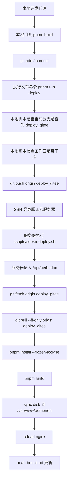
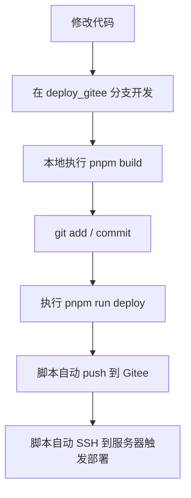
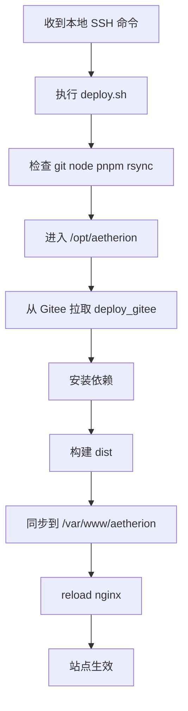
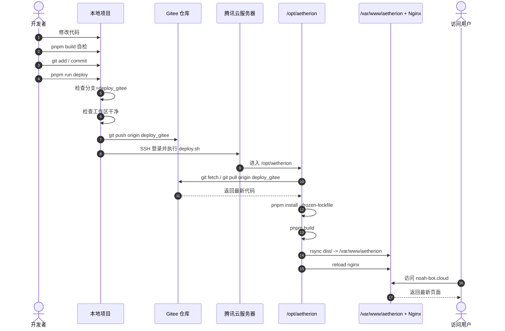

# DEPLOY_FLOW.md

## 文档目标

本文档说明 Aetherion 当前推荐的生产发布流程。

当前不再以 GitHub Actions 作为生产发布主链路，而是改为：

- `Gitee` 作为部署主仓
- 本地手动执行发布命令
- 腾讯云服务器自行拉取代码并完成构建
- `Nginx` 对外发布 `dist/` 产物

这样做的核心目的是减少跨网依赖，提高发布稳定性。

---

## 为什么不再使用 GitHub Actions 作为主发布链路

原方案存在两段不稳定链路：

1. `GitHub Actions -> 腾讯云服务器`
2. `腾讯云服务器 -> GitHub 私有仓库`

只要任意一段网络抖动，部署就可能失败。

新方案改为：

1. 本地推送代码到 `Gitee`
2. 本地直接 SSH 到腾讯云服务器触发部署
3. 服务器从 `Gitee` 拉取代码并本机构建

这样可以减少对 GitHub Actions 和 GitHub 跨网访问的依赖。

---

## 当前推荐部署链路

```text
本地修改代码
-> 本地执行 pnpm build 自检
-> git add / commit
-> 执行 pnpm run deploy
-> 本地脚本检查分支和工作区
-> git push origin deploy_gitee
-> SSH 登录腾讯云服务器
-> 服务器执行 scripts/server/deploy.sh
-> 服务器在 /opt/aetherion 拉取 deploy_gitee
-> 服务器执行 pnpm install --frozen-lockfile
-> 服务器执行 pnpm build
-> 服务器同步 dist/ 到 /var/www/aetherion
-> reload nginx
-> noah-bot.cloud 更新
```

---

## 总流程图



---

## 本地职责

本地负责：

1. 修改代码
2. 在 `deploy_gitee` 分支提交代码
3. 执行发布命令

本地不再依赖 GitHub Actions 完成生产部署。

### 本地发布流程



---

## 服务器职责

服务器负责：

1. 从 `Gitee` 拉取最新代码
2. 在 `/opt/aetherion` 中构建项目
3. 将 `dist/` 发布到 `/var/www/aetherion`
4. 通过 `Nginx` 对外提供静态站点

### 服务器执行流程



---

## 发布时序图



---

## 固定约定

当前发布流程固定约定如下：

- 主仓库：`Gitee`
- 发布远程：`origin`
- 发布分支：`deploy_gitee`
- 服务器源码目录：`/opt/aetherion`
- 服务器站点目录：`/var/www/aetherion`
- 对外域名：`noah-bot.cloud`

---

## 本地发布脚本默认参数

`pnpm run deploy` 默认使用以下配置：

- `DEPLOY_REMOTE=origin`
- `DEPLOY_BRANCH=deploy_gitee`
- `DEPLOY_HOST=58.87.71.61`
- `DEPLOY_PORT=22`
- `DEPLOY_USER=ubuntu`
- `DEPLOY_APP_DIR=/opt/aetherion`
- `DEPLOY_SITE_DIR=/var/www/aetherion`
- `DEPLOY_NGINX_SERVICE_NAME=nginx`
- `DEPLOY_RELOAD_NGINX=true`

如需临时覆盖，可在执行前通过环境变量指定。

---

## 日常发布步骤

```bash
pnpm build
git add .
git commit -m "your message"
pnpm run deploy
```

---

## 验收标准

每次发布后至少确认：

1. 服务器成功拉取 `deploy_gitee`
2. 服务器成功执行 `pnpm build`
3. `/var/www/aetherion` 已同步最新产物
4. 首页可正常访问
5. `/play/<slug>` 可正常打开对应游戏
6. 样式或游戏资源修改后，线上可见更新
