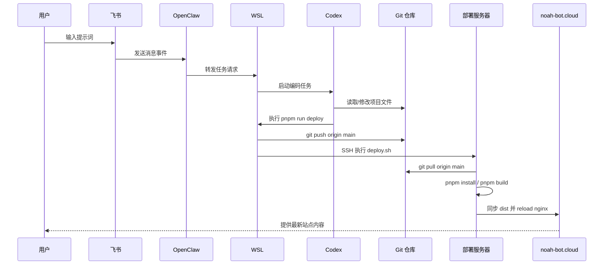

# Aetherion

Aetherion 是一个基于 Vite + Vue 3 + TypeScript 的小游戏门户项目。

当前特性：

- 门户首页展示游戏列表
- `iframe` 方式统一接入独立静态小游戏
- 构建前自动扫描 `games/` 并生成游戏清单
- 当前已接入 `Snake`、`2048`、`Flappy Bird`
- 已预留 GitHub Actions 自动部署流程

## 快速启动

### 环境要求

- 已安装 Node.js
- 已安装 `pnpm`，项目当前使用 `pnpm@10.32.1`

### 安装依赖

```bash
pnpm install
```

### 本地开发

```bash
pnpm dev
```

说明：

- 启动前会自动执行 `scripts/node/build-games.mjs`
- `games/` 下的小游戏会被扫描并同步到 `public/games/`
- 门户会读取生成后的 `public/game-manifest.json`

### 生产构建

```bash
pnpm build
```

构建完成后可在 `dist/` 中看到最终产物，发布目录以 `dist/` 为准。

### 本地预览构建结果

```bash
pnpm preview
```

### 新增小游戏

在 `games/` 下新增一个独立目录，例如：

```text
games/snake/
  index.html
  game.json
  style.css
  game.js
```

其中 `game.json` 至少包含：

```json
{
  "slug": "snake",
  "title": "贪吃蛇",
  "description": "经典贪吃蛇小游戏"
}
```

启动开发服务器或执行构建后，门户会自动把它加入游戏列表。

## 飞书驱动编码与自动部署流程

当前已经实现一条从飞书消息直接驱动本地编码与部署的工作流：

- 在飞书中输入提示词
- OpenClaw 将消息转发到 WSL 环境
- WSL 中触发 Codex 在当前仓库执行编码任务
- 任务完成后执行 `pnpm run deploy`
- 本地脚本自动推送代码并触发服务器更新站点

### 流程图


### 时序图



### 适用场景

- 适合通过自然语言快速驱动小改动、修复和发布
- 适合把“提需求 -> 改代码 -> 部署上线”压缩为一条链路
- 如果涉及高风险改动，仍建议先本地人工复核后再触发部署

## 跨系统开发说明

如果同一份工作区会在 Windows 和 Ubuntu / WSL 间切换，`vite` / `rollup` / `esbuild` 这类原生依赖不能直接共用另一套系统生成的 `node_modules`。

建议做法：

- 切换系统后优先重新执行一次 `pnpm install`
- 本项目脚本会优先修复 `rollup` 与 `esbuild` 的当前平台原生依赖
- 若你在 WSL 中开发，尽量使用 Linux 环境下安装出来的依赖后再执行 `pnpm dev` / `pnpm build`
